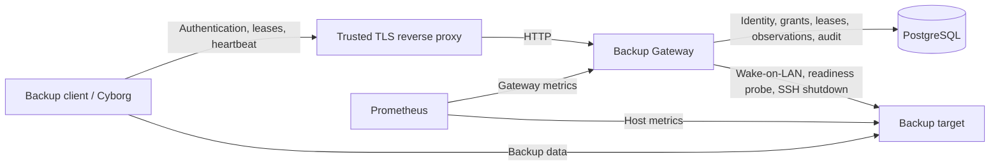

# Architecture Overview

Backup Gateway is the authoritative lifecycle coordinator for dedicated backup target nodes. Backup clients use its API to reserve a target, wait until the target is ready, maintain the reservation while a backup is active, and release it afterward. The gateway owns Wake-on-LAN and authenticated shutdown so individual clients do not need those network privileges.

The gateway is deliberately not in the backup data path. Borg or another backup tool continues to connect directly from the source to the target once the gateway reports the target ready. The gateway also does not schedule backup jobs or replace host monitoring; it coordinates target availability around work scheduled elsewhere.

This document describes how the major subsystems fit together. Focused contracts and implementation constraints live in the linked architecture documents.

## System boundary

PostgreSQL is the durable authority for security and coordination state. Target connection and lifecycle definitions are deployment configuration loaded into an immutable catalog at process startup. The target identifier is the stable join point between those two worlds. Persisted grants, observations, or leases do not activate a target that is absent from the current catalog.

The deployment supports exactly one active gateway process for a database. A PostgreSQL advisory lock enforces that deployment contract and the process terminates if ownership of the lock can no longer be verified. This guard prevents accidental duplicate instances; it does not provide the distributed fencing required for active-active replicas.

## Core state model

The central resource is a durable backup lease. A client chooses the lease UUID before acquisition, making the resource identifier its idempotency key. The lease records which authenticated client reserved which configured target.

Target power intent follows one rule:

- at least one `Held` lease means the target is desired `Online`;
- no `Held` leases means the target is desired `Offline`.

Heartbeat freshness does not weaken this rule. A stale lease remains held because loss of contact with the gateway cannot prove that the direct client-to-target backup has stopped. Only the owning client can normally release its lease; an administrator can force-release one after independently establishing that it is safe to do so.

The gateway separately persists an observed lifecycle state: `Unknown`, `Offline`, `Starting`, `Online`, `Stopping`, or `Faulted`. This observation describes what the coordinator most recently established about the target. It never overrides lease-derived desired state. A backup client should begin data transfer only while it still owns a held lease and the target is observed `Online`.

See [Lease Coordination](lease-coordination.md) for lease ownership, stale-heartbeat semantics, idempotency, administrative recovery, and concurrency rules.

## End-to-end backup lifecycle

A normal backup crosses the subsystems in the following order:

1. The backup client authenticates with its service identity and receives a short-lived signed bearer token.
2. The client acquires a caller-generated lease for a target. Authorization requires both the `backup-client` role and a current database-backed grant for that target.
3. Lease acquisition commits durable state and schedules reconciliation; the HTTP request does not remain open while the target boots.
4. Reconciliation re-derives desired state from held leases. If the target must be online, the gateway emits the configured Wake-on-LAN packet and waits for the bounded readiness probe to succeed before recording `Online`.
5. The client polls lease/target state. Once the target is `Online`, backup traffic flows directly between client and target. The client heartbeats the lease while it remains active.
6. The client releases the lease after the backup finishes. If another held lease exists, the target remains desired online.
7. When the final held lease is released, reconciliation runs the fixed authenticated SSH shutdown operation and confirms the target has become unavailable before recording `Offline`.

Lifecycle work for one target is serialized, but different targets can progress concurrently. Lease mutations use a separate per-target serialization boundary so an acquire or release does not wait behind a slow boot or shutdown operation. The reconciliation queue is level-triggered: duplicate work is harmless because every pass re-reads current durable intent instead of relying on a one-shot in-memory command.

See [Target Lifecycle Coordination](lifecycle.md) for the lifecycle state machine, transport contracts, transition races, and recovery behavior, and [Target Configuration](target-configuration.md) for the immutable network and SSH configuration supplied to those transports.

## Security and authorization boundary

ASP.NET Core Identity stores service identities, password hashes, roles, and security stamps. There is no public registration flow. Administrators provision backup clients and manage their per-target grants.

Authentication produces short-lived RS256 JWTs, but target authorization is intentionally not encoded solely into the token. Every protected target operation checks the current grant in PostgreSQL, so revoking a target grant takes effect without waiting for token expiry. Credential rotation updates the Identity security stamp and invalidates previously issued tokens.

The first administrator can be bootstrapped from deployment secrets only while the Identity store is empty. JWT signing keys, bootstrap credentials, and target SSH private keys remain outside PostgreSQL and the container image.

See [Authentication and Authorization](authentication-authorization.md) for token validation, bootstrap behavior, client provisioning, and grant semantics.

## Persistence and transaction boundaries

The gateway uses one PostgreSQL database for Identity and all durable coordinator state:

- Identity users, roles, and credentials;
- target grants;
- backup leases;
- target runtime observations;
- append-only audit events.

A grant has a normal foreign key to its Identity principal because it has no meaning after that principal is deleted. A lease deliberately stores its client identifier without an Identity foreign key. Deleting or revoking a compromised client must not cascade-delete a held lease and accidentally make a target eligible for shutdown.

Database transactions remain short. Durable state and audit intent are committed before correctness depends on them, but Wake-on-LAN, readiness polling, SSH, and shutdown waits happen outside database transactions. Reconciliation persists the resulting observation/outcome afterward and then derives desired state again because leases may have changed during external I/O.

See [Persistence Architecture](persistence.md) for the EF Core/WKG mapping model, database constraints, audit immutability, and transaction semantics.

## Startup and recovery

Startup establishes the invariants required before the API begins serving requests. Configuration loading first validates the complete target catalog. The runtime then acquires the single-instance advisory lock, applies EF Core migrations, loads the JWT signing key, reconciles configured target rows, and initializes Identity/bootstrap state.

Persisted lifecycle observations are not trusted as current evidence after a process restart. Configured targets are reset to `Unknown`, then periodic/queued reconciliation probes them and converges each target from current held leases. This handles crashes between a persisted transition and its external side effect without requiring an in-memory command log.

Failure behavior is biased toward preserving reservations rather than risking premature shutdown. A held lease survives client disappearance, gateway restart, Identity deletion, and stale heartbeats. Transport failures produce `Faulted` observations and bounded diagnostic codes while the durable lease continues to express the required power intent.

## Audit and operational visibility

Security-sensitive mutations and lifecycle side effects are recorded as append-only audit events with bounded identifiers and correlation IDs. Power-affecting lifecycle operations record intent before the external side effect and outcome afterward. Administrators can inspect target/lease diagnostics and recent audit history through the API.

Operational telemetry remains separate from durable audit history. `/metrics` exposes bounded gateway lifecycle and lease metrics, `/health/live` reports process liveness, and `/health/ready` verifies PostgreSQL connectivity. Backup-target hardware and host metrics remain a direct Prometheus responsibility rather than being proxied through the gateway.

See [Audit and Observability](observability.md) for correlation, audit coverage, metrics cardinality, health semantics, and safe failure reporting.

## External contracts and deployment

The checked-in [API v1 contract](../api/README.md) is the compatibility boundary for backup clients and is also served by the running gateway at `/openapi/v1.yaml`. The [deployment guide](../deployment.md) defines the reverse-proxy/TLS boundary, required network access, secret handling, container hardening, routed Wake-on-LAN considerations, PostgreSQL backup/restore, and deployment verification.

The focused architecture documents are:

- [Authentication and Authorization](authentication-authorization.md) - service identities, JWTs, roles, target grants, and bootstrap.
- [Target Configuration](target-configuration.md) - immutable target definitions, validation, secret references, and the configuration/database join point.
- [Lease Coordination](lease-coordination.md) - durable reservations, ownership, stale leases, desired state, concurrency, and force release.
- [Target Lifecycle Coordination](lifecycle.md) - reconciliation, Wake-on-LAN, readiness, SSH shutdown, state transitions, and restart recovery.
- [Persistence Architecture](persistence.md) - PostgreSQL/EF Core model, transaction boundaries, constraints, and durable-state ownership.
- [Audit and Observability](observability.md) - durable audit, correlation, diagnostics, metrics, and health checks.
